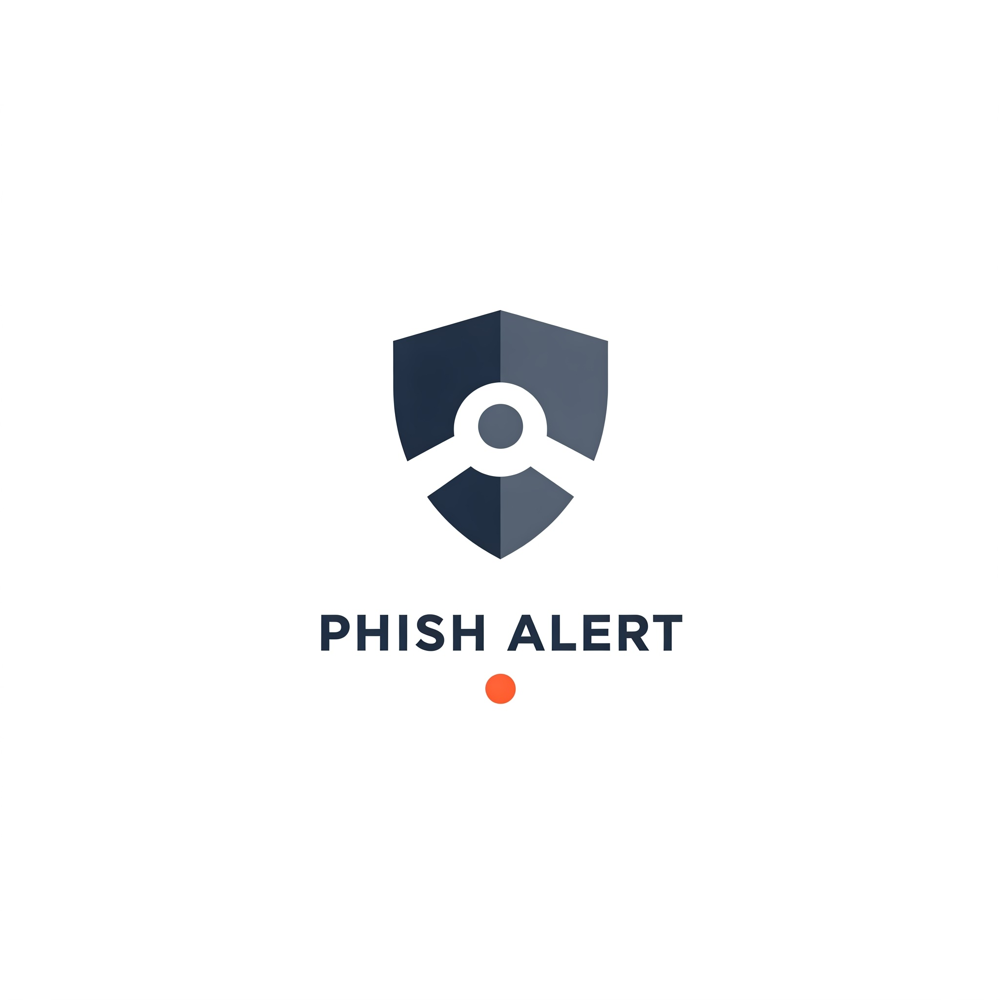

# Phish Alert - Chrome Extension



**Phish Alert** is a browser extension that helps detect potential phishing links and alerts users to avoid malicious websites. This extension scans webpages and highlights suspicious links to improve online security.

## 🚀 Features

- 🔍 Scans and detects potential phishing URLs.
- 🚨 Highlights suspicious links in red with a warning.
- ✅ Popup tool to manually check URLs.
- 🛡 Works automatically in the background.

## 🛠 Installation

1. **Clone the Repository:**
   ```sh
   git clone https://github.com/KIRAN-KUMAR-K3/phish-alert.git
   ```
2. **Open Chrome and go to:**
   ```
   chrome://extensions/
   ```
3. **Enable Developer Mode** (toggle in the top-right corner).
4. Click **Load Unpacked** and select the cloned `phish-alert` folder.
5. Extension is now active! 🎉

## 📌 How to Use

- When browsing, **suspicious links will be highlighted in red**.
- Hover over a link to see a warning tooltip.
- Click the extension icon to open the popup and **manually check a URL**.
- If a URL is flagged, avoid clicking on it!

## 🖥 File Structure

```
phish-alert/
├── background.js
├── content.js
├── icons/
│   ├── icon.png
├── manifest.json
├── popup.html
├── popup.js
```

## 📜 License
This project is licensed under the **MIT License**.

## 🤝 Contributing
Pull requests are welcome! Feel free to **fork** the repository and make improvements.

## 🌟 Show Some Love
If you find this project useful, **star ⭐ the repository** on GitHub!

---
📌 **Developed by [Kiran Kumar K](https://github.com/KIRAN-KUMAR-K3)**

